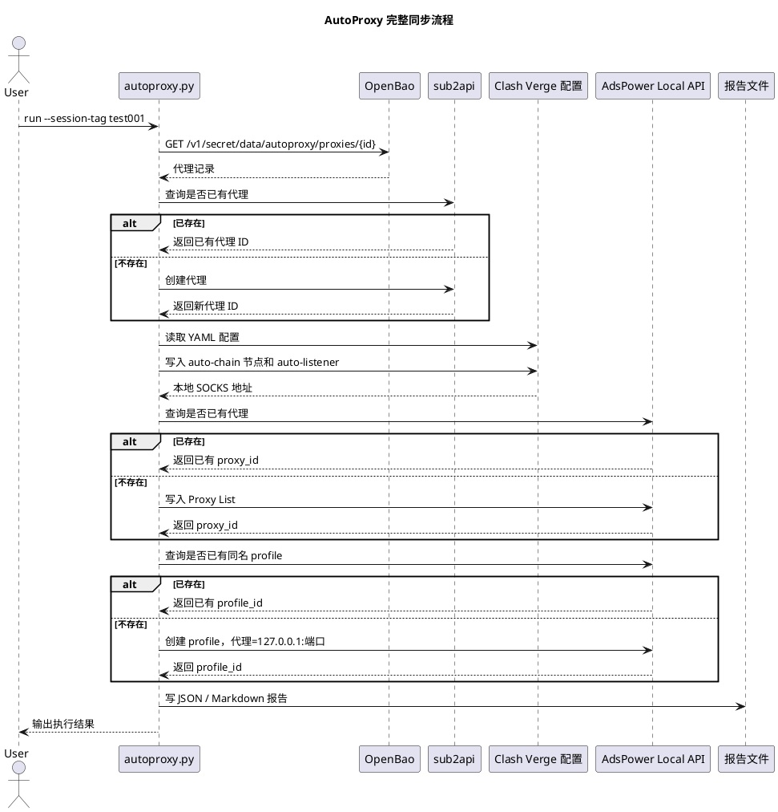

# AutoProxy 设计方案

## 背景

AutoProxy 用来把 OpenBao 中维护的代理资产，自动同步到本地代理链路和指纹浏览器环境中。它不是一个代理池系统，也不负责购买、检测或调度代理；它的定位是“把已经登记好的代理，按固定规则落到 sub2api、Clash Verge 和 AdsPower”。

目前的主要使用场景是：

```text
OpenBao 中维护代理信息
运行 AutoProxy
sub2api 记录代理
Clash Verge 生成链式代理和本地 SOCKS 端口
AdsPower 创建浏览器环境并使用该本地 SOCKS 端口
```

## 目标

- 代理信息统一存放在 OpenBao。
- 每条代理有稳定 ID 和可读名称。
- 可以通过 JSON 文件批量导入代理到 OpenBao。
- 能独立执行每个模块，便于排错。
- 支持 Windows、macOS、Linux 的常见本地运行方式。
- Clash 中每条代理都有独立的本地 SOCKS listener。
- AdsPower 环境只连接本地 SOCKS listener，不直接连接上游代理。
- 重复运行时尽量复用已有记录，减少重复数据。

## 非目标

- 不负责代理质量检测。
- 不负责 Clash Verge 自动 reload。
- 不负责 AdsPower 免费额度限制处理。
- 不做多用户权限系统。
- 不替代 OpenBao、sub2api、Clash Verge 或 AdsPower。

## 组件

### OpenBao

OpenBao 是代理资产的来源。每条代理存为 KV v2 secret，例如：

```text
secret/autoproxy/proxies/proxy-002
```

数据示例：

```json
{
  "name": "devtest",
  "type": "socks5",
  "host": "1.2.3.4",
  "port": 5678,
  "username": "testuser",
  "password": "testpass",
  "country": "US"
}
```

### sub2api

sub2api 保存代理记录，作为外部系统可见的代理库。AutoProxy 会先查重，再创建。

查重规则：

```text
protocol + host + port + username
```

### Clash Verge

Clash Verge 负责实际代理链路。配置中需要提前存在第一跳代理，例如 `hs2-US`。

导入代理后，AutoProxy 生成：

- `auto-chain-*` 代理节点
- `auto-listener-*` 本地 SOCKS listener
- `AUTO-CHAIN` 策略组

链路形态：

```text
AdsPower -> 127.0.0.1:7890 -> Clash listener -> hs2-US -> OpenBao 代理 -> 目标站点
```

### AdsPower

AdsPower 负责创建浏览器环境。AutoProxy 会：

- 写入 AdsPower Proxy List
- 创建浏览器 profile
- profile 名称使用 OpenBao 中的 `name`
- profile 代理指向本地 Clash SOCKS listener

## CLI

入口文件：

```bash
python3 autoproxy.py
```

常用命令：

```bash
python3 autoproxy.py openbao-get
python3 autoproxy.py openbao-import --file examples/openbao-proxies.example.json
python3 autoproxy.py sub2api-sync
python3 autoproxy.py clash-write
python3 autoproxy.py adspower-add-proxy
python3 autoproxy.py adspower-create-profile
python3 autoproxy.py run --session-tag test001
```

默认配置读取顺序是 `config.local.json`、`config.openbao.json`、`config.openbao.example.json`。
配置文件中的相对路径按配置文件所在目录解析；所有本地文件按 UTF-8 读写。

## 时序图



## 幂等策略

- sub2api：按 `protocol + host + port + username` 查重。
- AdsPower Proxy List：按 `type + host + port + user` 查重。
- AdsPower Profile：按 profile 名称和本地代理端口查重。
- Clash：同名 `auto-chain-*` 节点复用，同名 listener 复用。

## 后续计划

- OpenBao 支持按目录批量 list。
- Clash Verge / Mihomo 自动 reload。
- AdsPower profile 清理命令。
- Clash 自动生成节点清理命令。
- dry-run 模式。
